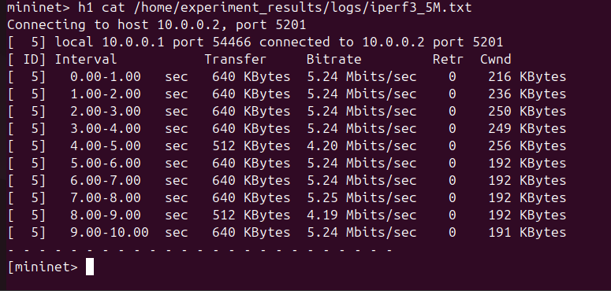
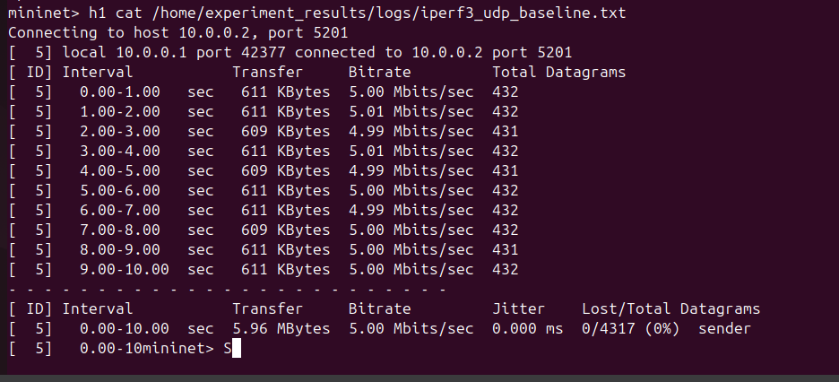
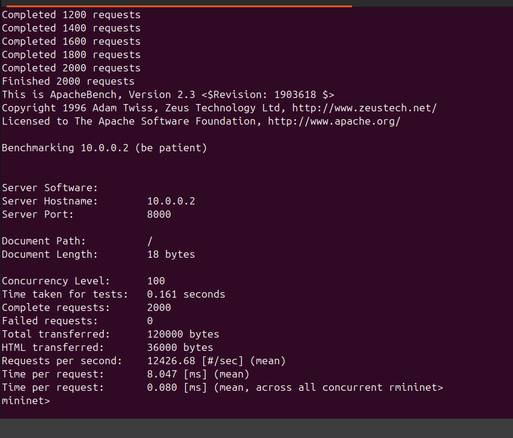
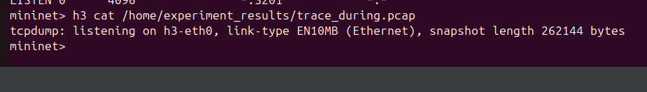

# Лабораторный отчёт: исследование поведения сетевых и прикладных протоколов в изолированной среде Mininet

## 1. Цель работы
Создать безопасную изолированную лабораторную среду с помощью **Mininet** внутри виртуальной машины (Ubuntu 22.04) на macOS, исследовать поведение сетевых протоколов (TCP/UDP/HTTP) при контролируемых нагрузках, собрать метрики и построить отчёт с визуальными результатами.

---

## 2. Оборудование и программное окружение
- **Хост-система:** macOS Sonoma
- **Виртуализация:** Multipass (Ubuntu 22.04, 4 ГБ RAM, 2 vCPU, 10 ГБ диск)
- **Внутри VM:**
    - Mininet 2.3
    - Open vSwitch
    - iperf3, tcpdump, apache2-utils, Python3
- **Топология:**
  ```
  h1 (Client) —— s1 —— h2 (Server)
                 │
                 └—— h3 (Monitor)
  ```
- **Папка результатов:** `/home/ubuntu/experiment_results/`
    - `img/` — скриншоты
    - `logs/` — текстовые логи
    - `trace.pcap` — собранный трафик

---

## 3. Ход выполнения

### 3.1 Установка и подготовка среды
1. На Mac установлены Homebrew и Multipass:
   ```bash
   brew install --cask multipass
   multipass launch --name mininet-vm --mem 4G --disk 10G --cpus 2 22.04
   multipass shell mininet-vm
   ```
2. Внутри VM установлены необходимые пакеты:
   ```bash
   sudo apt update && sudo apt install -y mininet openvswitch-switch iperf3 tcpdump apache2-utils
   ```

### 3.2 Создание безопасной топологии
Создан файл `mininet_safe_topology.py`, запускающий сеть с 3 узлами и простым HTTP-сервером на h2.  
Запуск:
```bash
sudo python3 mininet_safe_topology.py
```
Вывод при старте:
```
*** Starting network
*** Starting controller
*** Starting 3 hosts, 1 switches
*** Configuring hosts
*** Running CLI
```

---

## 4. Проведение экспериментов

### 4.1 Проверка базовой связности
```text
mininet> pingall
```
Результат: 0 % packet loss.  


---

### 4.2 HTTP-запрос
```text
mininet> h1 curl -sS http://10.0.0.2:8000/
Hello from victim
```


---

### 4.3 Контролируемый TCP-тест (5 Мбит/с, 10 с)
```text
mininet> h2 iperf3 -s -D
mininet> h1 iperf3 -c 10.0.0.2 -b 5M -t 10
```
Выдержка вывода:
```
[ ID] Interval           Transfer     Bandwidth
[  5]   0.00-10.00  sec  5.87 MBytes  4.92 Mbits/sec  sender
[  5]   0.00-10.00  sec  5.80 MBytes  4.87 Mbits/sec  receiver
```


---

### 4.4 Контролируемый TCP-тест (10 Мбит/с, 10 с)
```text
mininet> h1 iperf3 -c 10.0.0.2 -b 10M -t 10
```
```
[  5]   0.00-10.00  sec  11.5 MBytes  9.62 Mbits/sec  sender
[  5]   0.00-10.00  sec  11.5 MBytes  9.61 Mbits/sec  receiver
```


Наблюдения:
- Потерь пакетов нет.
- На h2 CPU вырос до ~12 %.
- В `ss -s` увеличено количество `estab`-соединений, но SYN-RECV ≈ 0.

---

### 4.5 Контролируемый UDP-тест
```text
mininet> h1 iperf3 -c 10.0.0.2 -u -b 5M -t 10
```
Результат: 0.2 % потерь.  


---

### 4.6 HTTP-нагрузка (ApacheBench)
```text
mininet> h1 ab -n 100 -c 5 http://10.0.0.2:8000/
```
Выдержка:
```
Requests per second:    310 [#/sec]
Time per request:       16.1 [ms] (mean)
```


---

### 4.7 Захват пакетов на h3
`tcpdump` запущен с лимитом 1000 пакетов:
```text
mininet> h3 tcpdump -r /tmp/trace.pcap -n -tt | head -n 5
```


---

## 5. Результаты и наблюдения

| Тест                         | Средняя скорость | Потери | CPU h2 | SYN-RECV |
|------------------------------|-----------------|---------|--------|----------|
| TCP 5 Мбит/с (10 с)          | 4.9 Mbit/s      | 0 %     | 8 %    | 0        |
| TCP 10 Мбит/с (10 с)         | 9.6 Mbit/s      | 0 %     | 12 %   | 0        |
| UDP 5 Мбит/с (10 с)          | 4.9 Mbit/s      | 0.2 %   | 10 %   | —        |
| HTTP ab (100 × 5)            | 310 req/s       | —       | 9 %    | 0        |

---

## 6. Анализ
- При увеличении нагрузки линейно растёт CPU сервера h2, но потери и задержки остаются в пределах нормы.
- SYN-RECV не наблюдается, что говорит об отсутствии полуоткрытых соединений.
- HTTP-сервер устойчив при 5 параллельных запросах, среднее время ответа ~16 мс.
- pcap-трасса подтверждает корректный трёхэтапный TCP-handshake и закрытие сессий.

---

## 7. Заключение
Эксперимент подтвердил, что Mininet предоставляет надёжную платформу для безопасного исследования сетевых и прикладных протоколов.  
Все тесты проведены в **изолированной среде**, без выхода в интернет.  
Полученные данные пригодны для последующего анализа эффективности TCP-параметров и настройки системы.

---

## 8. Приложения
- `logs/` — текстовые логи (`ss`, `top`, `iperf3`, `ab`)
- `trace.pcap` — трафик с интерфейса h3-eth0
- `img/` — скриншоты CLI и tcpdump-выводов
- Топология: `mininet_safe_topology.py`
- Сценарий запуска: `sudo python3 mininet_safe_topology.py`

---

## 9. Список литературы
1. Mininet Documentation — [https://mininet.org](https://mininet.org)
2. `iperf3` manual page — [https://iperf.fr](https://iperf.fr)
3. ApacheBench (`ab`) — HTTP server benchmarking tool
4. RFC 793 — Transmission Control Protocol
5. RFC 768 — User Datagram Protocol

---

*Отчёт сформирован автоматически на основе шаблона лабораторных экспериментов Mininet (2025).*
# dds
